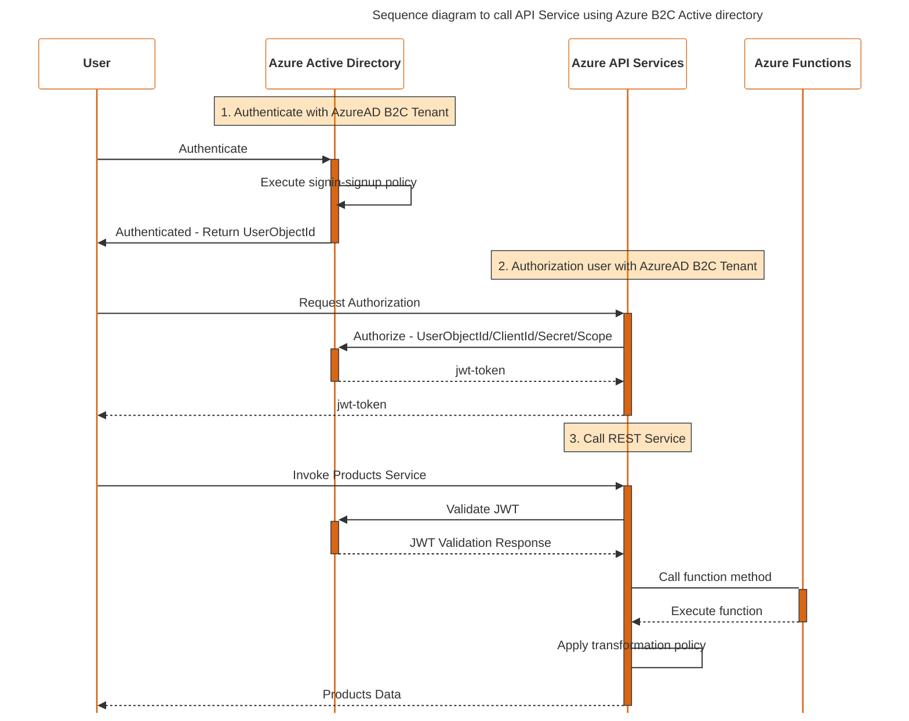
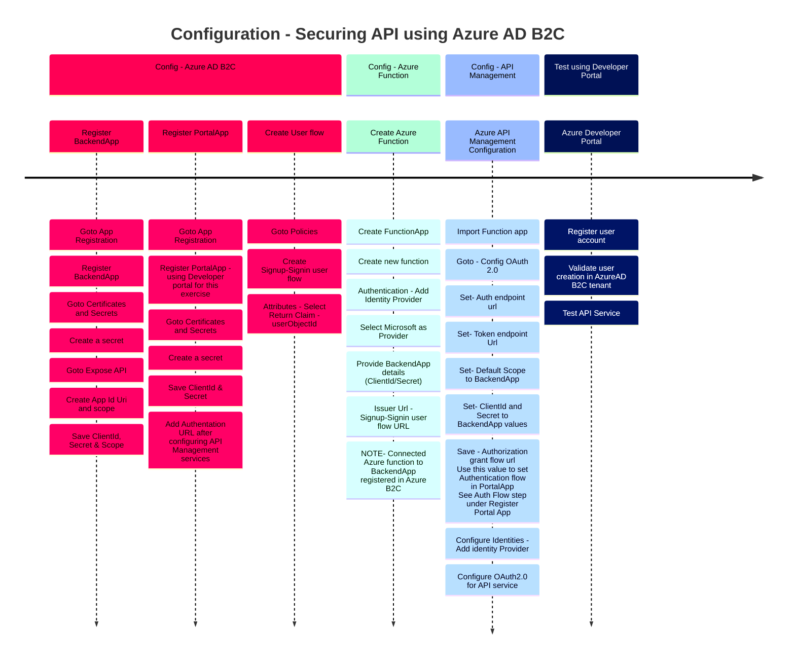

As an enterprise architect, using text-based diagrams can be a smarter approach for several reasons. Text-based diagrams offer superior portability and accessibility, as they are lightweight and can be shared as plain text files through various communication channels, reaching a broader audience without the need for specialized software. Furthermore, by being version-controlled using tools like Git, text-based diagrams facilitate seamless collaboration among team members, enabling efficient tracking of changes and supporting geographically dispersed teams. The absence of proprietary formats ensures long-term compatibility and mitigates issues related to software transitions. Additionally, integrating text-based diagrams within documentation enhances readability, provides context-rich understanding, and simplifies collaborative editing, enabling real-time updates. Overall, this method empowers architects to create clear and concise representations, while being programmatically generated from data sources, enhancing automation, consistency, and accessibility for all stakeholders.

I found Mermaid to be good enough for small use cases. However, for more complex diagrams others like PlantUML is more suitable. However, Mermaid has the potential to become a strong contender as they rollout new features.

Key benefit of using Mermaid - No server installation. Entire diagrams are rendered using JavaScript in the browser.

As a test case, I took a lesson from [The Ultimate Azure API Management course](https://www.udemy.com/course/the-ultimate-azure-api-management-course/) and tried to capture a sequence diagram and configuration steps using Timeline Diagram

**Source code for Sequence diagram**

    %%{init: {'sequence': { 'mirrorActors': false, 'rightAngles': true, 'messageAlign': 'center', 'actorFontSize': 20, 'actorFontWeight': 900, 'noteFontSize': 18, 'noteFontWeight': 600, 'messageFontSize': 14}}}%%
    %%{init: {'theme': 'base', 'themeVariables': {'labelBoxBkgColor': 'lightgrey', 'labelBoxBorderColor': '#000000', 'actorBorder': '#D86613', 'actorBkg': '#ffffff', 'activationBorderColor': '#232F3E', 'activationBkgColor': '#D86613', 'noteBkgColor': 'rgba(255, 153, 0, .25)', 'noteBorderColor': '#232F3E'}}}%%

    sequenceDiagram
        title Sequence diagram to call API Service using Azure B2C Active directory
        participant User
        participant AzureAD as Azure Active Directory
        participant APIService as Azure API Services
        participant AzureFunctions as Azure Functions

        note over AzureAD: 1. Authenticate with AzureAD B2C Tenant

        User ->>+ AzureAD: Authenticate
        AzureAD ->> AzureAD: Execute signin-signup policy
        AzureAD ->>- User: Authenticated - Return UserObjectId

        note over APIService: 2. Authorization user with AzureAD B2C Tenant
        User ->>+ APIService: Request Authorization
        APIService ->>+ AzureAD: Authorize - UserObjectId/ClientId/Secret/Scope
        AzureAD -->>- APIService: jwt-token
        APIService -->>- User: jwt-token

        note over APIService: 3. Call REST Service
        User ->>+ APIService: Invoke Products Service
        APIService ->>+ AzureAD: Validate JWT
        AzureAD -->>- APIService: JWT Validation Response
        APIService ->+ AzureFunctions: Call function method
        AzureFunctions -->>- APIService: Execute function
        APIService -> APIService: Apply transformation policy
        APIService -->>- User: Products Data

**Source code for Timeline**

    %%{init: { 'logLevel': 'debug', 'theme': 'default' , 'themeVariables': {
                  'cScale0': '#ff0055', 'cScaleLabel0': '#000',
                  'cScale1': '#b3ffd9',
                  'cScale2': '#99bbff',
                  'cScale3': '#001155', 'cScaleLabel3': '#ffffff'
          } } }%%

    timeline
        title Configuration - Securing API using Azure AD B2C
        section Config - Azure AD B2C
        Register BackendApp : Goto App Registration
                            : Register BackendApp
                            : Goto Certificates and Secrets
                            : Create a secret
                            : Goto Expose API
                            : Create App Id Uri and scope
                            : Save ClientId, Secret & Scope
        Register PortalApp  : Goto App Registration
                            : Register PortalApp - using Developer portal for this exercise
                            : Goto Certificates and Secrets
                            : Create a secret
                            : Save ClientId & Secret
                            : Add Authentation URL after configuring API Management services

        Create User flow     : Goto Policies
                            : Create Signup-Signin user flow
                            : Attributes - Select Return Claim - userObjectId

        section Config - Azure Function
        Create Azure Function: Create FunctionApp
                            : Create new function
                            : Authentication - Add Identity Provider
                            : Select Microsoft as Provider
                            : Provide BackendApp details (ClientId/Secret)
                            : Issuer Url - Signup-Signin user flow URL
                            : NOTE- Connected Azure function to BackendApp registered in Azure B2C

        section Config - API Management
        Azure API Management Configuration : Import Function app
                            : Goto - Config OAuth 2.0
                            : Set- Auth endpoint url
                            : Set- Token endpoint Url
                            : Set- Default Scope to BackendApp
                            : Set- ClientId and Secret to BackendApp values
                            : Save - Authorization grant flow url   Use this value to set Authentication flow in PortalApp   See Auth Flow step under Register Portal App
                            : Configure Identities - Add identity Provider
                            : Configure OAuth2.0 for API service

        section Test using Developer Portal
        Azure Developer Portal: Register user account
                              : Validate user creation in AzureAD B2C tenant
                              : Test API Service

_References :_

- [Kevin Hakanson - Sequence Diagrams with Mermaid and Diagrams.net](https://kevinhakanson.com/2022-10-02-sequence-diagrams-with-mermaid-and-diagramsnet/)
- [Mermaid Chart- Create complex, visual diagrams with text. A smarter way of creating diagrams](https://mermaid.js.org/)
- [Configure Hugo to render Mermaid Charts](https://gohugo.io/content-management/diagrams/#mermaid-diagrams)
