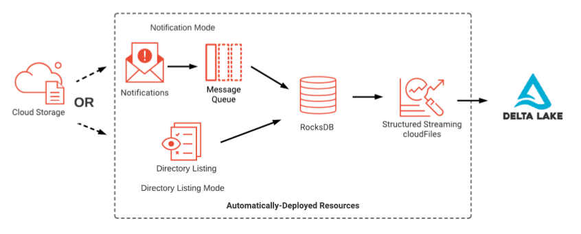

_Declarative programming will expedite the Return on Investment in your modern data warehouse implementation._

I recently watched Michael Armbrust's insightful presentation at the Data + AI Summit 2023, where he initiated the discussion by emphasizing the advantages of Declarative Programming. Throughout his talk, he delved into the innovative features of Delta Live Tables, DLT Pipelines, HMR, serverless computing, Enzyme, and more.

His primary message, **"Declarative programs specify what should be done, not how to do it"** left a lasting impression.

Throughout my years of experience working on numerous projects involving the implementation of Data Warehousing and Data Engineering technologies, I faced various challenges related to ingesting data from a wide range of external sources. The entire data workflow, encompassing the movement of data into a landing zone and its subsequent loading into a Data Warehouse, demanded countless person-hours of:

- Writing Solution Architecture Documents.
- Presenting to Enterprise Architects for their approvals.
- Ensuring that Data Engineers adhered to the best practices during solution implementation.
- Following ITSM protocols encompassing the design, creation, delivery, and support of IT Services.

DataBricks Autoloader can dramatically reduce the person-hours to design and deliver data ingestion solution. **Importantly, the Return on Investment (ROI) is predominantly tied to the savings in person-hours needed to develop and manage a solution over its lifetime.**

DataBricks Autoloader provides two modes to ingest data.

1. File Notifications mode - Event-driven paradigm to upload files as soon as they arrive in the landing zone
1. Directory listing mode - Constantly poll directories at predefined intervals and upload data.

Let's focus on the File Notifications mode feature.

As shown in the illustration, in order to implement File Notification mode, we need to create message queues, define event subscriptions and connect the dots to make everything work in a seamless fashion. This involves leveraging tools like Terraform IaaC, CI/CD tools, Agile and DevOps practices. There is plenty of in-house experience to accomplish these tasks.

But what if you didn't have to undergo all these steps? What if there were no more project plans or Kanban boards required? Imagine delivering a solution in just a single page of code. Moreover, what if this code could be generated by ChatGPT in seconds?

Curious to see how this can be achieved effortlessly? And What's next? Stay tuned and watch my video on how it's done.

#### [Technical deep dive on implementing declarative programming for data ingestion on YouTube](https://www.youtube.com/watch?v=_9Oi9rZRwmo)

#

---

#

_Credit:_ [Derar AlHussein, DataBricks Data Engineering Courses on Udemy](https://www.udemy.com/user/derar-alhussein/)  
&emsp;Sample data and helper functions are from these courses. Thank you for sharing your expertise.

_YouTube:_ [Delta Live Table A to Z: Best Practices for Modern Data Pipelines](https://www.youtube.com/watch?v=PIFL7W3DmaY&t=2977s)

_Code on GitHub:_ [Autoloader Demo](https://github.com/cooolbabu/Databricks-Certified-Data-Engineer-Associate/tree/main/Autoloader-Demo)
