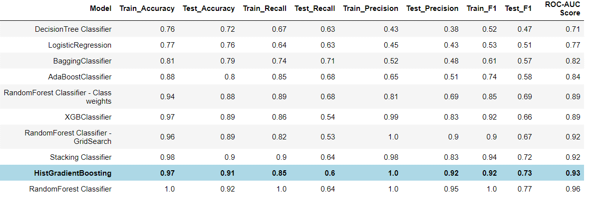

This is a scratch post to view various features of PaperMod theme

### Powerpoint Presentation

[PowerPoint](https://1drv.ms/p/s!AvWe2XCN4ByLmRrrhaL04zCfkq8p?e=2xQeEw)

#### Some issues that still need to be worked upon

- This is a sample. Post with cover image. Need to work on this issue.

- The following link doesn't work.
- [Xlabel](MIT_capstone.md)
- 





##### Using Raw html



Write this text right-to-left



##### Using rtl shortcode

 Hello .. this is left to right message 
