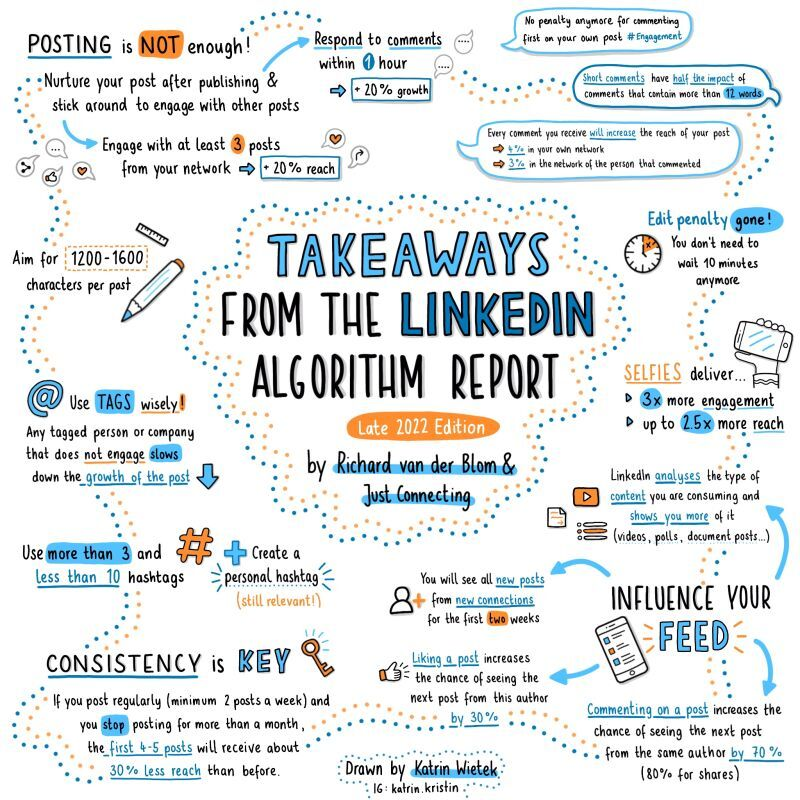

Every professional should dedicate a reasonable amount of time each week to LinkedIn. This commitment serves as an investment in job security, and there are two main reasons for doing so.

- **Personal Branding** Your company HR is always looking for 'Great Candidates' to fill a certain post. Why not let them find you on LinkedIn

- **Professional Networking** If you are furloughed, find your next opportunity quickly

Finally,

- In the future, your LinkedIn score may determine whether you get to keep the job or not

This visualiztion says it all

_Source :_ [Katrin Weitek](https://www.katrin-kristin.com/)
[Richard van der Blom](https://www.linkedin.com/in/richardvanderblom/)
